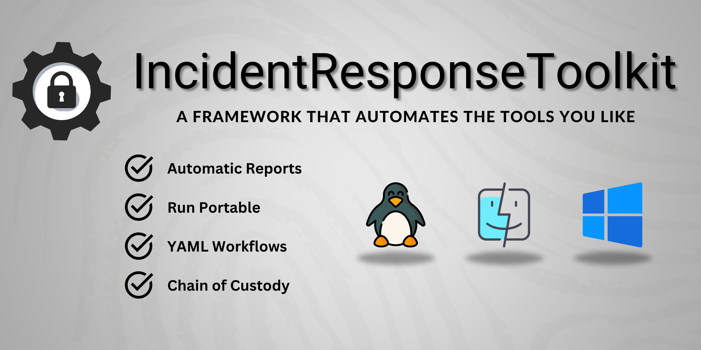
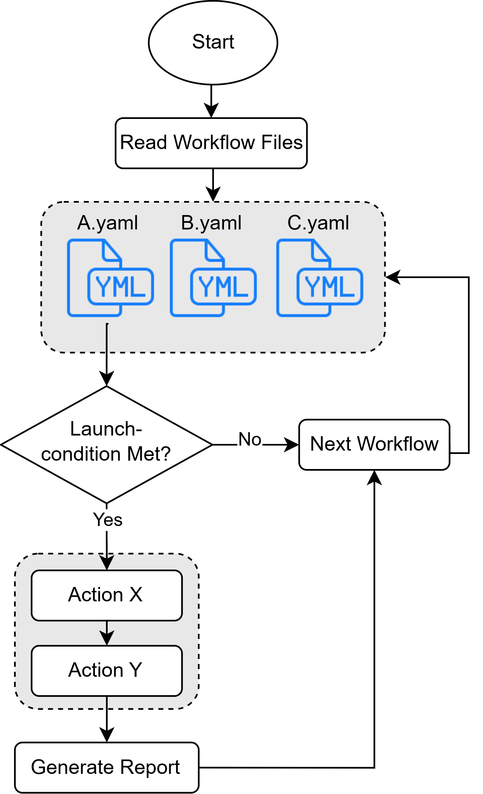

# ir-toolkit

<p align="center">
    
</p>

IR-Toolkit is a portable framework to automate your scripts and tools using workflows. It is designed to assist incident responders and digital forensic analysts in data aquisition.

Check out the [documentation](https://freilichtbuehne.github.io/ir-toolkit/index.html) for more instructions on how to get started.

## Features

- **Portable**: The collector is inside a directory structure that can be stored on a USB drive or network share.
- **Compatibility**: The toolkit is compatible with Windows, Linux, and macOS.
- **Pre-defined Actions**:
    - **Binary**: Execute a binary file.
    - **Store**: Collect files based on patterns.
    - **Yara**: Scan files using Yara rules.
    - **Terminal**: Open a graphical terminal window with a transcript.
- **Launch Conditions**: Each workflow can be configured to run only on specific conditions (e.g., OS, architecture, output of a command). When executing the collector, all workflows are evaluated, and only the ones that match the conditions are executed.
- **Reporting**: All collected files, logs, and metadata are compressed and stored in a `.zip` archive. The archive can optionally be encrypted using a either `AES-128-GCM` or `CHACHA20-POLY1305` algorithm. The report can be unpacked using the `unpacker` tool. The archiving and encryption can be disabled if not needed.


## Quick Start

1. Download the latest release
2. Extract the contents to a directory
3. Define your workflows in the `/workflows` directory
4. Execute the collector using `run.ps1` (Windows) or `run.sh` (Linux/macOS)
5. Locate the generated report in the `/reports` directory
6. Unpack the report using the `unpacker` tool

<p align="center">
    
</p>

## Example Workflow

Using workflows you can automate the execution of tools and scripts. The following workflow will execute the defined actions in the specified order. The generated report, including all the collected data, will be compressed and encrypted using the specified public key:

```yaml
properties:
  title: "Windows Demo"
  description: "This is a demo"
  author: "John Doe"
  version: "1.0"

launch_conditions:
  os: ["windows"]
  arch: ["x86", "x86_64"]

actions:
  - name: autorunsc
    type: binary
    attributes:
      path: "autorunsc.exe"
      log_to_file: true

  - name: pdf_files
    type: yara
    attributes:
      rules_paths: |
        ${CUSTOM_FILES_DIR}\\yara\\*.yara
      files_to_scan: |
        ${USER_HOME}\\Downloads\\*
      store_on_match: true
      scan_timeout: 4s

  - name: find_executables
    type: store
    attributes:
      case_sensitive: false
      patterns: |
        ${USER_HOME}/Downloads/**/*.exe
      size_limit: 10 GB

  - name: terminal
    type: terminal
    attributes:
      wait: true
      separate_window: true
      enable_transcript: true

workflow:
  - action: autorunsc
    timeout: 20s
    parallel: true
  - action: pdf_files
  - action: find_executables
  - action: terminal

reporting:
  zip_archive:
    enabled: true
    encryption:
      enabled: true
      public_key: "example_public.pem"
      algorithm: CHACHA20-POLY1305
    compression:
      enabled: true
      size_limit: 100 MB
  metadata:
    mac_times: true
    checksums: true
    paths: true
```